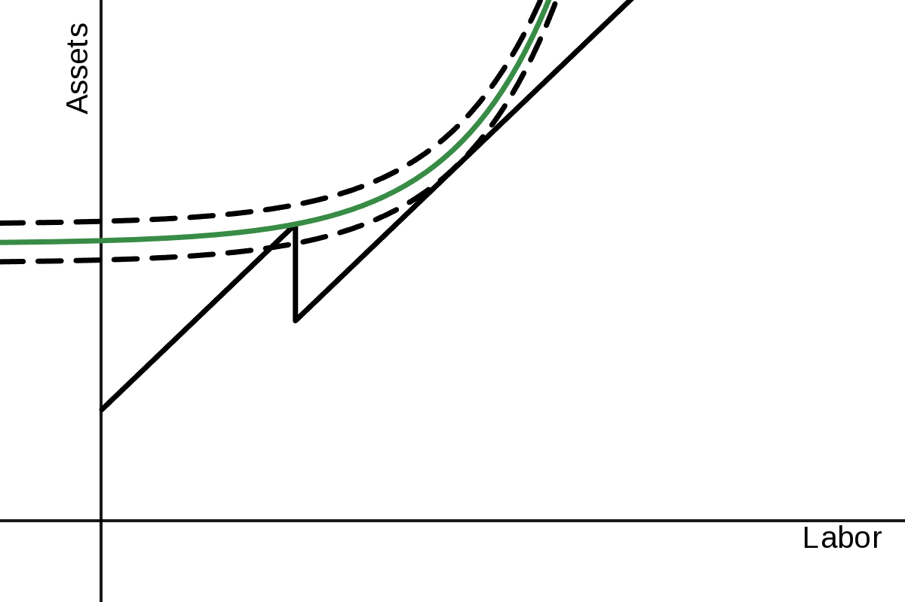
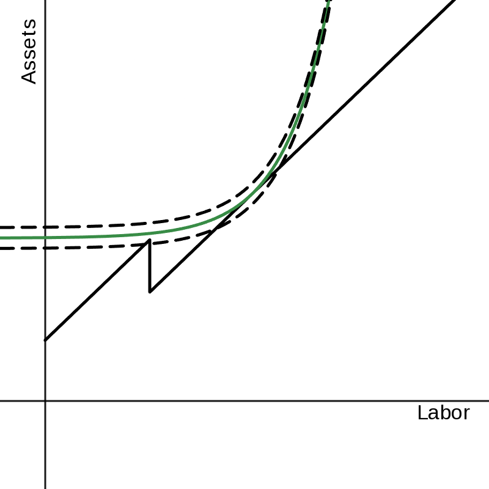
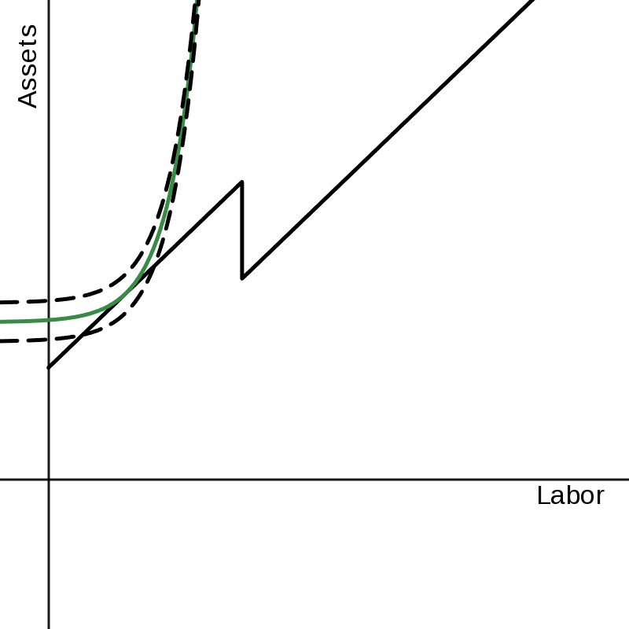
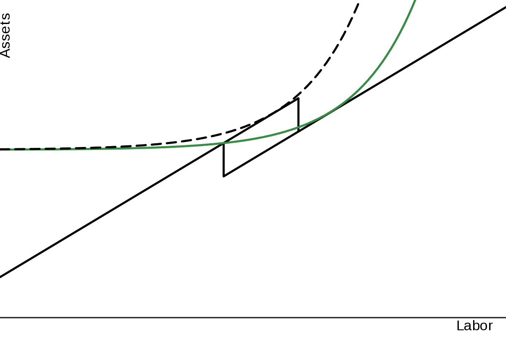

# 1.a.
The discount factor is the weight at which future income is devalued when calculating its present value.

In this case, a discount factor of 0.95 means that the value of 1 dollar of income 1 period into the future is 95 cents.

# 1.b.
$$
r=\frac{1}{d}-1 = \frac{1}{19} \approx 0.05263157895...
$$

# 1.c.
$$
NPV_{X} = \sum_{x \in X} \frac{x_\text{value}}{(1-r)^{x_\text{period}}}
$$$$
NPV_\text{op} = \$15.2635
$$$$
NPV_\text{ac} = \$12.2635
$$

I'd rather be an ophthalmologist.

# 1.d.
$$
IRR_{X}=\sqrt[\text{length}(X)]{\frac{\sum_{x \in X}{x_\text{value}}}{NPV_{X}}}-1
$$$$
IRR_\text{op}=2 \sqrt[4]{\frac{2250}{30527}} - 1 \approx 0.04208847665...
$$

This value is less than the interest rate.

# 1.e.
$$
NPV_\text{op} = \$1.792
$$$$
NPV_\text{ac} = \$6.32
$$

The inverse is now true. I'd rather be an accountant.

# 2.a.
Taste.

# 2.b.
Taste. (Key word, the physician only "believes" this is the case and does not have statistical evidence.)

# 2.c.
Statistical.

# 2.d.
Taste. (Again, this is belief. However, in this case, giving *more* attention to a group instead of less because of a discriminatory practice is not considered to be racist by the wider public. It is, under the strictest definition, racism, but I doubt people would complain about receiving extra attention from their doctor for free.)

# 3.a.
$$
H = \frac{10}{10^2} = 0.1
$$

# 3.b.
$$
H = 9\left(\frac{1}{90}\right)^2 + \left(\frac{9}{10}\right)^2 = \frac{73}{90} = 0.8\overline{1}
$$

Increases in H represent a decrease in competition.

# 3.c.
The largest value is 1; this occurs when market share is completely held by a single company. In other words, when there is a monopoly.

# 3.d.
In the case of the market with the 1 large firm and 9 smaller firms, a single firm taking an 11${}^\text{th}$ of the market share will increase competition. The value in this case is:$$
H = 9\left(\frac{1}{90} \cdot \frac{10}{11}\right)^2 + \left(\frac{9}{10} \cdot \frac{10}{11}\right)^2 + \left(\frac{1}{11}\right)^2 = \frac{739}{1089} \approx 0.6786042241...
$$ ...which is less than the previous value, thus having more competition.

# 3.e.
$$
H = \lim_{n \rightarrow \infty} n\left(\frac{1}{n}\right)^2
= \lim_{n \rightarrow \infty} \frac{1}{n}
= 0
$$

# 4.a.
$$
1 \cdot 6 \text{yr} = q \cdot 10 \text{yr} \rightarrow q = \frac{3}{5}
$$

# 4.b.
$$
B = 0.7 \cdot \left(70 - 20\right) -
0.6 \cdot \left(70 - 20\right)
= 5
$$$$
C = \$10,000
$$$$
ICER = \frac{C}{B} = \$2,000
$$

# 4.c.
$$
QALY_{20} = 5 \rightarrow B_{20} = 5 \cdot \$5,000 = \$25,000 > \$10,000
$$$$
QALY_{60} = 1 \rightarrow B_{60} = 1 \cdot \$5,000 = \$5,000 < \$10,000
$$$$
QALY_{69} = 0.1 \rightarrow B_{69} = 0.1 \cdot \$5,000 = \$500 < \$10,000
$$

At the cost of $\$10,000$, it is worth it for the 20-year-old but neither the 60 nor 69-year-old.

# 4.d.
$$
\$25,000 > \$1,000
$$$$
\$5,000 > \$1,000
$$$$
\$500 < \$1,000
$$

At the cost of $\$1,000$, it is worth it for the 20 and 60-year-old, but still not the 69-year-old.

# 5.a.
If a worker were to work any number of hours in the interval $(L_1,L_2]$, they could earn the same or more value for performing less work. They will always prefer that, and so all values of labor in that interval result in a utility which falls below other achievable input values of $L$.

# 5.b.
For *most* workers, it is less than.

# 5.c.
It would shrink. The higher point given by $L_1$ would fall, and thus the value of $L_2$ would meet the line at a point closer to $L_1$.

# 5.d.
As discussed in **5.a.**, The values at or below $L_1$ (at an equivalent value) are always preferable to any value given from labor in the interval $(L_1,L_2]$, which includes the value *at* $L_2$. This is because they could work less for the same value.

# 5.e.
It would expand the region. It is already the case that $(L_1,L_2]$ is unfavorable, but adding an extra inventive to that only adds to the pile. Take a point some small distance above $L_2$, say $L_2 + \varepsilon$; this value would have a higher return to utility from the pay gained from working, but it would also come with the marginal disutility of $\varepsilon$. The exact values of these will depend on some derivatives at the points, but in the end the disutility of $\varepsilon$ more units of labor will overpower the utility of extra income for small values of $\varepsilon$.

# 5.f.
{width=60%}
{width=50%}
{width=50%}

# 5.g.
Any utility curve which meets the line at a point in the interval $(L_1,L_2]$ will pass through the line some place below the value $L_1$. This means that there must be some higher indifference curve which also meets the line.

# 5.h.
{width=50%}

As we can see in this figure, the increase in the income threshold has incentivised workers at $L_1$ to work somewhere in the interval $(L_1,L_2)$.